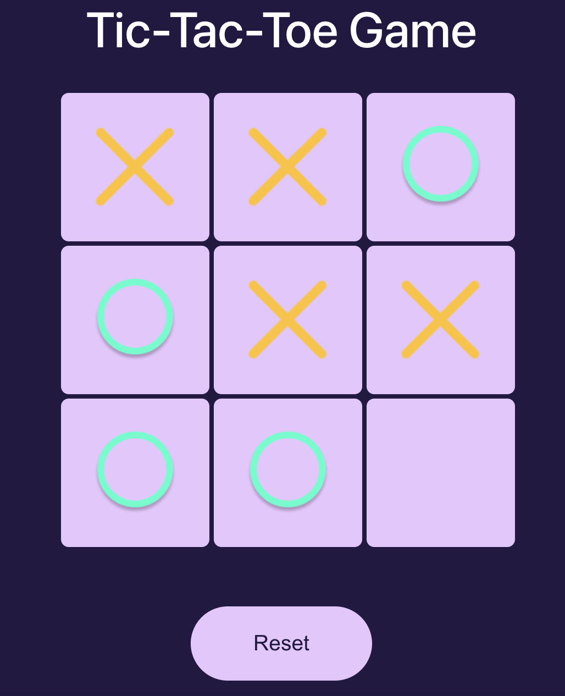

# React Tic-Tac-Toe Game

## Overview
This is a simple Tic-Tac-Toe game built with React. It allows two players to take turns marking spaces on a 3x3 grid until one player wins or the game ends in a draw.

## Features
- **Two Player Gameplay:** Play against a friend locally on the same device.
- **Interactive Board:** Click on empty spaces to mark them with 'X' or 'O'.
- **Win Detection:** Automatically detects when a player wins the game by getting three of their symbols in a row, column, or diagonal.
- **Game Reset:** Restart the game at any time to play again.

## How to Play
1. Open the game in your web browser.
2. Two players take turns clicking on empty spaces to mark them with their symbol ('X' or 'O').
3. The game automatically detects when a player wins by getting three of their symbols in a row, column, or diagonal.
4. If all spaces on the board are filled and no player has won, the game ends in a draw.
5. To play again, click the "Restart" button to reset the game board.

## Game Components
- **Board:** Displays the 3x3 grid for the Tic-Tac-Toe game.
- **Square:** Represents each individual space on the game board where players can mark their symbols.
- **Status:** Shows the current status of the game, including which player's turn it is and whether there is a winner or a draw.
- **Restart Button:** Allows players to reset the game board and start a new game.

